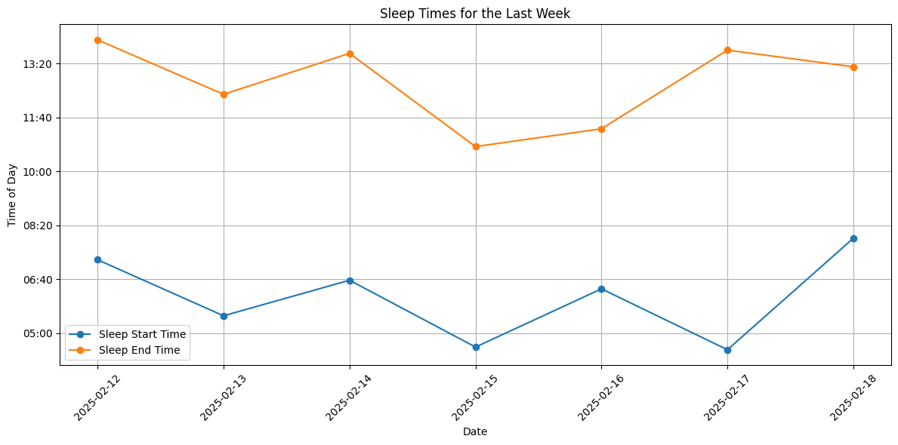

# Analysis of data from a wearable using natural language.

## Support:

- Garmin (In-progress)
- TODO

## Usage:

```
> source .env
> PYTHONPATH=./ python app/main.py --task "Plot my sleep times for last week"
```

An executed ipynb notebook will be created in the artifacts directory with the desired task completed.



## Dev guide

### ENV

- Set all required env vars in .env
- `source .env && python app/main.py`

### Langfuse

- Clone and run server: https://langfuse.com/self-hosting/local
- Set up API keys via UI

## TODOs

- [x] observability with text
- [ ] observability with images
- [x] handling long text outputs in jupyter cells
- [x] handling errors in executing notebook
- [x] partial execution of notebook to avoid repeated login
- [ ] verify output loop
- [ ] saving traces
- [ ] profiling speed of solver
- [ ] dataset of tasks for evaluation
- [ ] shorter cell outputs
- [ ] handle case where login fails
