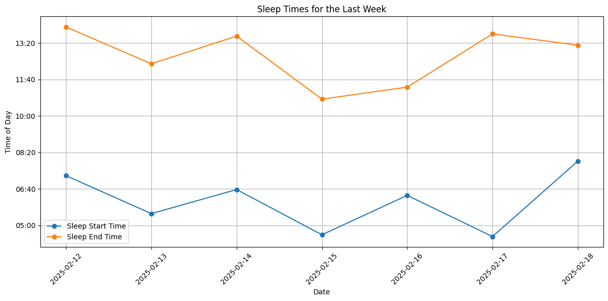
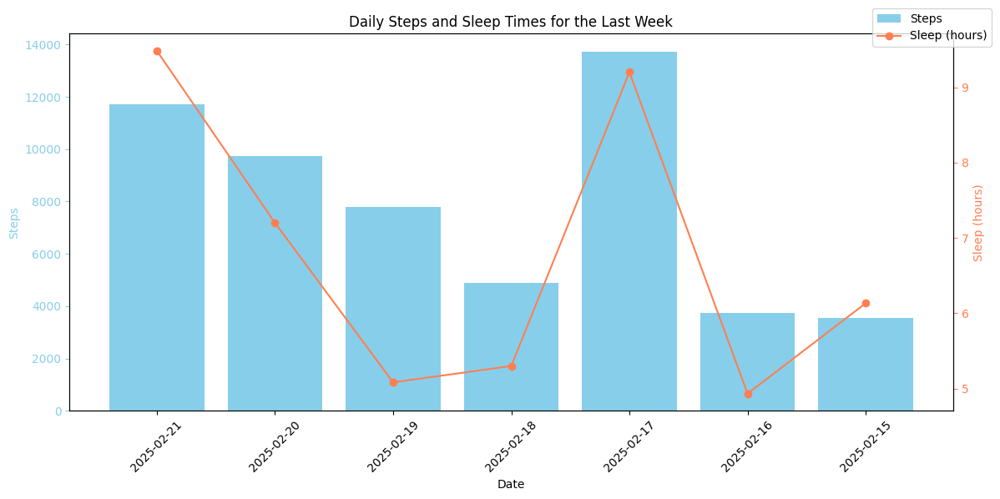
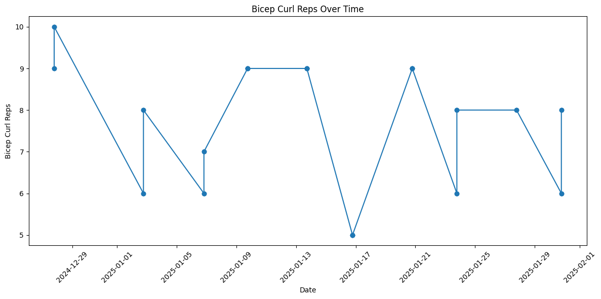

# Analysis of data from a wearable using natural language.

## Support:

-   Garmin

## Usage:

```
> source .env
> PYTHONPATH=./ python app/main.py --task "Plot my sleep times and steps daily for last week in the same plot"
```

An executed ipynb notebook will be created in the artifacts directory with the desired task completed.

## Examples

The final plot from the notebooks are shown below.

### Sleep durations



### Steps and sleep correlation

(More steps -> better sleep)


### Workout reps

(Did not aggregate reps across sets)

